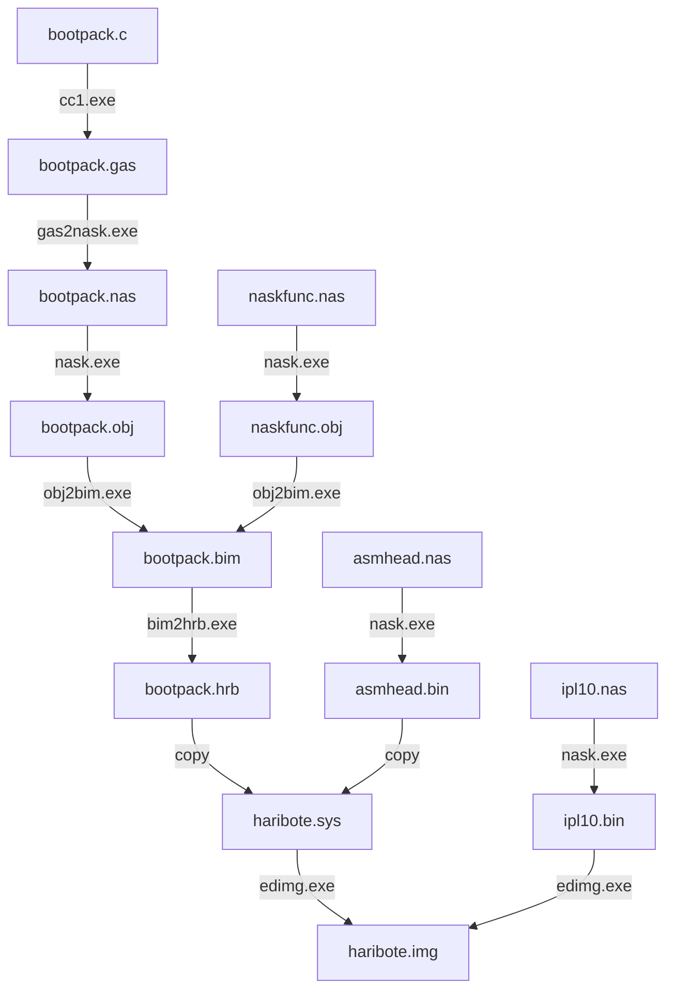

# Day 03

> asmhead用于调用C语言写的程序
>
> 后续再进行解读

## 本章节代码内容

- asmhead.nas

    haribote：汇编部分

- bootpack.c

    haribote：C语言部分

- naskfunc.nas

    haribote：汇编函数，提供给C语言部分调用

- ipl10.nas

    IPL读取程序到内存，并执行程序

## bootpack.c是如何变成机器语言的

1. 使用`cc1.exe`从`bootpack.c`生成`bootpack.gas`

    cc1是C编译器，将C语言程序编译成汇编语言源程序。但这个C编译器是笔者从gcc的编译器改造而来，而gcc又是以gas汇编语言为基础，输出的是gas用的源程序。

2. 使用`gas2nask.exe`从`bootpack.gas`生成`bootpack.nas`

    把gas文件转换成nask文件的程序

3. 使用`nask.exe`从`bootpack.nas`生成`bootpack.obj`

    制作obj目标文件

4. 使用`obi2bim.exe`，通过`bootpack.obj`、`naskfunc.obj`生成`bootpack.bim`

    链接目标文件，制作二进制映像文件

5. 使用bim2hrb.exe从bootpack.bim生成bootpack.hrb

    使用 `bim2hrb.exe` 工具将 BIM 文件 `bootpack.bim` 转换为可执行的 HRB 文件 `bootpack.hrb`

至此已经将`bootpack.c`转变为机器语言文件`bootpack.hrb`

使用copy指令将`asmhead.bin`与`bootpack.hrb`拼接到一起，就成了`haribote.sys`

## 编译过程

## 为什么C语言中调用汇编函数时，函数名前面多了下划线

C函数在编译为汇编时，所有的函数名都会被加上下划线；（c转译为gas时发生的）

因此，在naskfunc.nas中编写的函数，要提前写好下划线；
