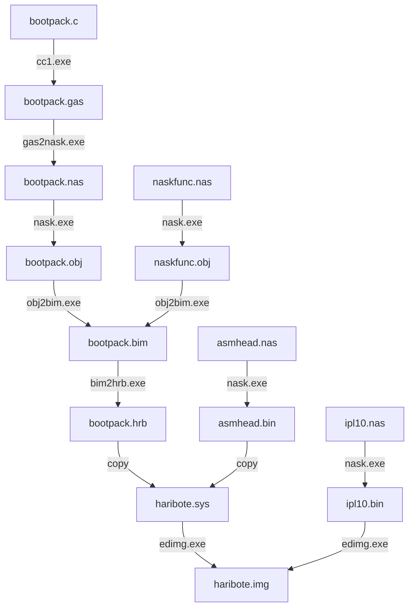

# Day 03

> asmhead用于调用C语言写的程序
>
> 后续再对内容解读

## 本章节代码内容

- asmhead.nas

    haribote：汇编部分

- bootpack.c

    haribote：C语言部分

- naskfunc.nas

    haribote：汇编函数，提供给C语言部分调用

- ipl10.nas

    IPL读取程序到内存，并执行程序

## bootpack.c是如何变成机器语言的

1. 使用`cc1.exe`从`bootpack.c`生成`bootpack.gas`

    cc1是C编译器，将C语言程序编译成汇编语言源程序。但这个C编译器是笔者从gcc的编译器改造而来，而gcc又是以gas汇编语言为基础，输出的是gas用的源程序。

2. 使用`gas2nask.exe`从`bootpack.gas`生成`bootpack.nas`

    把gas文件转换成nask文件的程序

3. 使用`nask.exe`从`bootpack.nas`生成`bootpack.obj`

    制作obj目标文件

4. 使用`obi2bim.exe`，通过`bootpack.obj`、`naskfunc.obj`生成`bootpack.bim`

    链接目标文件，制作二进制映像文件

5. 使用bim2hrb.exe从bootpack.bim生成bootpack.hrb

    使用 `bim2hrb.exe` 工具将 BIM 文件 `bootpack.bim` 转换为可执行的 HRB 文件 `bootpack.hrb`

至此已经将`bootpack.c`转变为机器语言文件`bootpack.hrb`

使用copy指令将`asmhead.bin`与`bootpack.hrb`拼接到一起，就成了`haribote.sys`

## 编译过程



## 设定调色板

https://wiki.osdev.org/VGA_Hardware#Port_0x3C8

1. 屏蔽中断

2. 将想要设定的调色板号码写入0x03c8端口

3. 按R，G，B的顺序写入0x03c9端口（如果还想继续设定下一个调色板，可以继续按R、G、B顺序写入，无需设定调色板号码）

4. 如果要读出当前调色板的状态，首先要将调色板的号码写入0x03c7端口，再从0x03c9读取3次。读出的顺序就是R，G，B。（如果还想继续读取下一个调色板，可以继续按R、G、B顺序读取，无需设定调色板号码）

5. 恢复中断

## 指针

在今日的代码中，借助C语言中指针，可以很方便的向内存中写入调色板色号

以下有几种不同的写法，后面的写法可读性、维护性更好

Example 0:

```c
int i; /*变量声明。变量i是32位整数*/
char *p; /*变量p，用于BYTE型地址*/

    for (i = 0xa0000; i <= 0xaffff; i++) {

        p = i; /*代入地址*/
        *p = i & 0x0f;

        /*替代write_mem8(i, i & 0x0f);*/
    }

```

Example 1:

```c
p = (char *) 0xa0000; /* 显示内存 */

for (i = 0; i <= 0xffff; i++) {
    *(p + i) = i & 0x0f;
}
```

Example 2:

```c
p = (char *) 0xa0000; /*显示内存*/

for (i = 0; i <= 0xffff; i++) {
    p[i] = i & 0x0f;
}
```

## 向端口发送数据

```assembly
	MOV EDX,端口号
	OUT DX,数据
```

## 通过端口获取数据

```assembly
	MOV EDX,端口号
	IN 数据存放位置,DX
```

## EFLAGS寄存器

EFLAGS是由名为FLAGS的16位寄存器扩展而来的32位寄存器

> FLAGS是存储**进位标志**和**中断标志**等标志的寄存器。

进位标志是EFLAGS的第0位。

进位标志可以通过`JC`或`JNC`等跳转指令来简单地判断到底是0还是1。但对于中断标志，没有类似的命令，所以只能读入EFLAGS，再检查第9位是0还是1。

寄存器内容参见 https://en.wikipedia.org/wiki/FLAGS_register


## 堆栈

堆栈数据结构（stack data structure）的原理与盘子堆栈相同：新值添加到栈顶，删除值也在栈顶移除。

堆栈也被称为 LIFO 结构（后进先出，Last-In First-Out），其原因是，最后进入堆栈的值也是第一个出堆栈的值。

## 堆栈运行原理

运行时堆栈是内存数组，CPU 用 ESP（扩展堆栈指针，extended stack pointer）寄存器对其进行直接管理，该寄存器被称为堆栈指针寄存器（stack pointer register）。32位模式下，ESP 寄存器存放的是堆栈中某个位置的 32 位偏移量。ESP 基本上不会直接被程序员控制，反之，它是用 CALL、RET、PUSH 和 POP 等指令间接进行修改。ESP 总是指向添加，或压入（pushed）到栈顶的最后一个数值。运行时堆栈工作于系统层，处理子程序调用。堆栈 ADT 是编程结构，用于实现基于后进先出操作的算法。

## 堆栈指令

### PUSH

PUSH 指令首先减少 ESP 的值，再将源操作数复制到堆栈。

### POP

POP 指令首先把 ESP 指向的堆栈元素内容复制到一个 16 位或 32 位目的操作数中，再增加 ESP 的值。

### PUSHFD 和 POPFD

PUSHFD 指令把 32 位 EFLAGS 寄存器内容压入堆栈。

POPFD 指令则把栈顶单元内容弹出到 EFLAGS 寄存器。

不能用 MOV 指令把标识寄存器内容复制给一个变量，因此，PUSHFD 可能就是保存标志位的最佳途径。有些时候保存标志寄存器的副本是非常有用的，这样之后就可以恢复标志寄存器原来的值。

### PUSHAD，PUSHA，POPAD 和 POPA

PUSHAD 指令按照 EAX、ECX、EDX、EBX、ESP（执行 PUSHAD 之前的值）、EBP、ESI 和 EDI 的顺序，将所有 32 位通用寄存器压入堆栈。

POPAD 指令按照相反顺序将同样的寄存器弹出堆栈。与之相似，PUSHA 指令按序（AX、CX、DX、BX、SP、BP、SI 和 DI）将 16 位通用寄存器压入堆栈。

POPA 指令按照相反顺序将同样的寄存器弹出堆栈。在 16 位模式下，只能使用 PUSHA 和 POPA 指令。

## 读写EFLAGS

### 读取

```assembly
    PUSHFD
    POP EAX
```

### 写入

```assembly
    PUSH EAX
    POPFD
```
