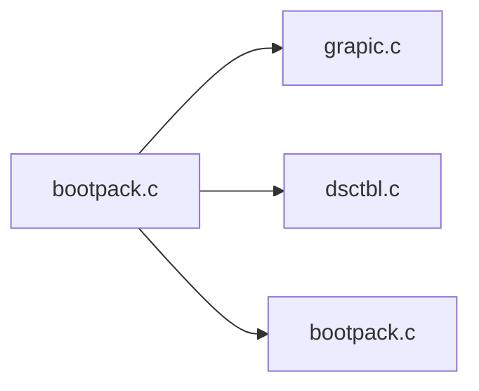
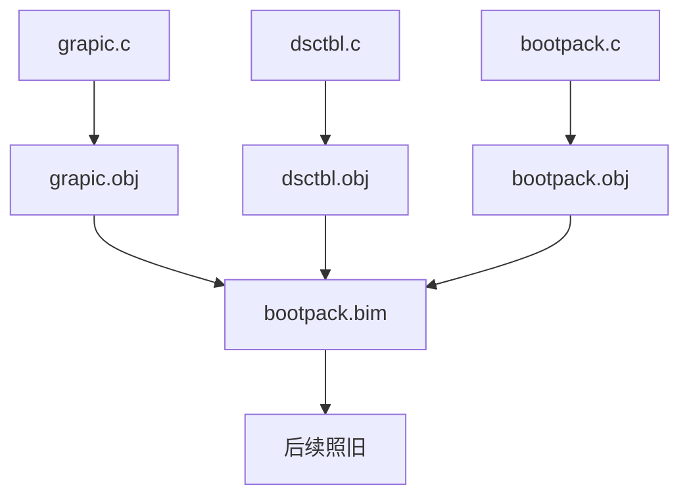
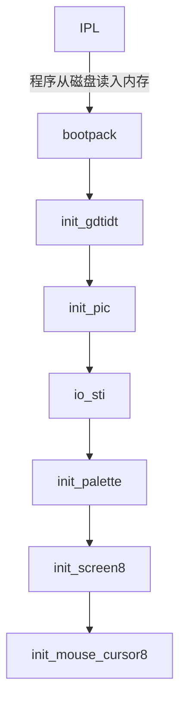

# Day06

## bootpack分割



| 文件       | 功能                                 |
| ---------- | ------------------------------------ |
| grapic.c   | 负责绘图相关                         |
| dsctbl.c   | 关于GDT, IDT等descriptor table的处理 |
| bootpack.c | 其他处理                             |

### 编译过程



上图为了方便查阅，简化了c->gas->nas->obj的流程，实际上编译C语言并没有发生变化

## 精简Makefile

```makefile
%.gas : %.c Makefile
    $(CC1) -o $*.gas $*.c

%.nas : %.gas Makefile
    $(GAS2NASK) $*.gas $*.nas
```

可以通过这种方法，优化重复的部分


## 系统启动顺序



## LIFO堆栈

> last in, frist out; 后进先出

在x86架构汇编中，堆栈的生长方向是向低地址方向，也就是栈顶的地址会逐渐减小。所以，当你执行"push"操作时，栈顶指针（ESP - Extended Stack Pointer）会减小，因为新的数据被压入堆栈。

### PUSH

将数据推入堆栈

等效于

```assembly
ADD ESP,-4
MOV [SS:ESP],EAX
```

## POP

将数据从堆栈中取出

等效于

```assembly
MOV EAX,[SS:ESP]
ADD ESP,4
```

## PUSHAD

将一系列寄存器按顺序推入堆栈

```assembly
PUSH EAX
PUSH ECX
PUSH EDX
PUSH EBX
PUSH ESP
PUSH EBP
PUSH ESI
PUSH EDI
```


## POPAD

反过来，POPAD指令相当于按以上相反的顺序，把它们全都POP出来。